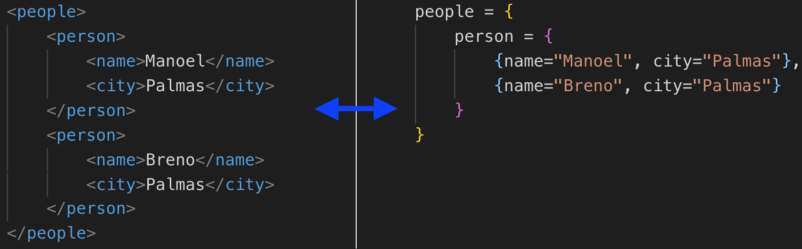

:source-highlighter: highlightjs
:numbered:
:unsafe:

= xml2lua image:https://travis-ci.org/manoelcampos/xml2lua.svg?branch=master[Build Status,link=https://travis-ci.org/manoelcampos/xml2lua] image:http://img.shields.io/badge/license-MIT-brightgreen.svg[MIT license,link=http://opensource.org/licenses/MIT] image:https://img.shields.io/luarocks/v/manoelcampos/xml2lua[LuaRocks,link=https://luarocks.org/modules/manoelcampos/xml2lua]

pass:[]

ifdef::env-github[]
:outfilesuffix: .adoc
:caution-caption: :fire:
:important-caption: :exclamation:
:note-caption: :paperclip:
:tip-caption: :bulb:
:warning-caption: :warning:
endif::[]

*xml2lua* is an XML parser written entirely in Lua which doesn't depend on any external C/C++ library.
It works for Lua 5.1 to 5.3 and enables:

* parsing an XML string into a Lua Table;
* converting a Lua Table to an XML string.

This version was adapted to work with Lua 5 and can be used in Lua applications, including
interactive Digital Television (DTV) http://gingancl.org.br/en[Ginga NCL applications] for the http://www.dtv.org.br[Brazilian DTV System]
(worldwide known as https://en.wikipedia.org/wiki/ISDB-T_International[ISDB-T International or ISDB-Tb]).

The original parser was written by Paul Chakravarti and is available on http://lua-users.org/wiki/LuaXml[LuaUsers].

== Installation

=== From LuaRocks repository

The best way to download the module is using
https://luarocks.org/modules/manoelcampos/xml2lua[LuaRocks] at the command line:

[source,bash]
----
luarocks install xml2lua
----

=== From local sources

Download the source files using the download button above or type at a terminal:

[source,bash]
----
git clone https://github.com/manoelcampos/xml2lua.git
----

Finally, enter the directory where the source files were downloaded and type:

[source,bash]
----
luarocks make
----

== How to use

=== Parsing an XML String into a Lua Table

A simplified example which parses an XML directly from a string is presented below.
*There are some caveats to deal with when an XML has just one tag.
Check the link:example1.lua[example1.lua] for details.*

[source,lua]
----
local xml2lua = require("xml2lua")
--Uses a handler that converts the XML to a Lua table
local handler = require("xmlhandler.tree")

local xml = [[
<people>
  <person type="natural">
    <name>Manoel</name>
    <city>Palmas-TO</city>
  </person>
  <person type="legal">
    <name>University of Brasília</name>
    <city>Brasília-DF</city>
  </person>  
</people>    
]]

--Instantiates the XML parser
local parser = xml2lua.parser(handler)
parser:parse(xml)

--Manually prints the table (since the XML structure for this example is previously known)
for i, p in pairs(handler.root.people.person) do
  print(i, "Name:", p.name, "City:", p.city, "Type:", p._attr.type)
end
----

=== Converting a Lua Table to an XML String

[source,lua]
----
local xml2lua = require("xml2lua")
local people = {
    person = {
        {name="Manoel", city="Palmas-TO", _attr={ type='natural' } },
        {name="Breno", city="Palmas-TO", _attr={ type='legal' } }
    }
}

print("People Table\n")
xml2lua.printable(people)

print()
print("XML Representation\n")
print(xml2lua.toXml(people, "people"))
----

== Command line tool

You can use a command line tool to try parsing XML files.
Execute `lua testxml.lua -help` on the terminal for more details.

== Running tests

=== Requeriments

You must have https://docs.docker.com/compose/install/[installed docker and docker compose].

=== How to

[source,bash]
----
make lint # to run the lint check
make test # to run the acceptance tests
----

== License

This code is freely distributable under the terms of the link:LICENSE[MIT license].

== Authors

* Manoel Campos da Silva Filho http://about.me/manoelcampos
* Paul Chakravarti link:mailto:&#112;a&#117;&#x6c;&#x63;&#x40;&#x70;&#97;&#x73;&#x73;t&#104;&#x65;&#97;a&#114;&#100;&#118;a&#114;k&#x2e;&#99;&#x6f;&#x6d;[&#112;a&#117;&#x6c;&#x63;&#x40;&#x70;&#97;&#x73;&#x73;t&#104;&#x65;&#97;a&#114;&#100;&#118;a&#114;k&#x2e;&#99;&#x6f;&#x6d;]
